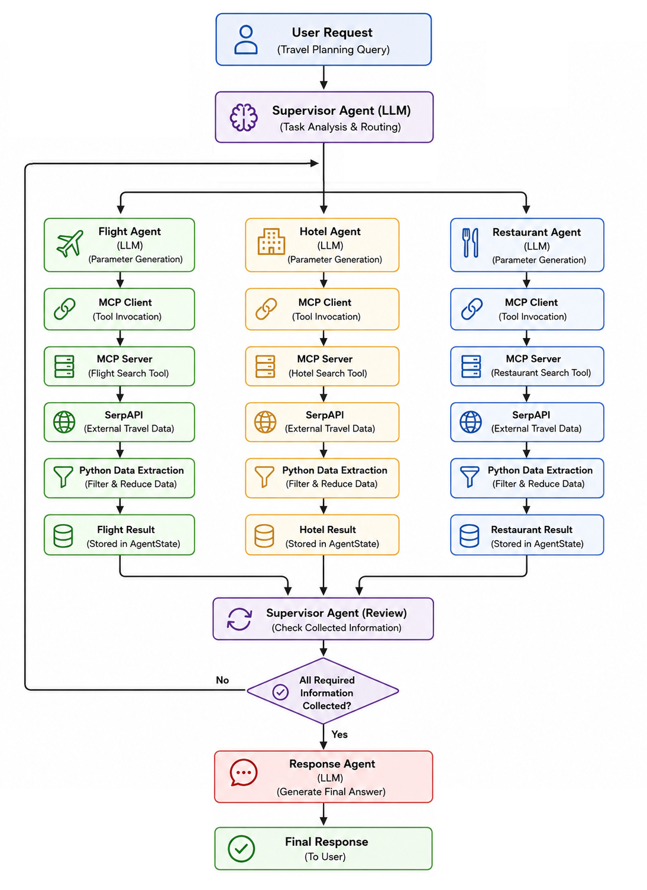

# LangGraph Multi Agent Travel Planner

## Project Overview

This project is a Multi Agent AI travel planning system built with LangGraph. A Supervisor Agent analyzes the user request and coordinates specialized agents for flights, hotels, and restaurants.

The system combines LangGraph, MCP, LLM reasoning, external travel APIs, and AWS services to provide a complete Agentic AI workflow.

The current version uses Bedrock, AgentCore Runtime, AgentCore Gateway, ECR, and FastAPI. An earlier version of the project used Groq as the LLM provider.

## Key Features

* Multi Agent workflow built with LangGraph
* Supervisor Agent for dynamic task routing
* Specialized Flight, Hotel, and Restaurant agents
* Response Agent for final answer generation
* Model Context Protocol (MCP) integration
* SerpAPI integration for external travel data
* Structured shared state using Pydantic
* Python based data extraction and filtering
* FastAPI API
* Docker containerization
* Bedrock integration
* AgentCore Runtime and Gateway deployment
* ECR container registry
* Asynchronous communication

## Architecture

The system is organized around a Supervisor Agent and several specialized agents. The Supervisor receives the user request, analyzes the workflow state, decides which agent should run next, and generates the instructions for that agent.

The Flight, Hotel, and Restaurant agents process their assigned tasks and use MCP tools to retrieve external travel information. The Response Agent uses the collected results to generate the final response.

The different components share a structured `AgentState`, which contains the user request, routing information, and processed results. This keeps the workflow modular and separates orchestration, reasoning, tool execution, and data processing.

The application is containerized with Docker and deployed using ECR and AgentCore Runtime. AgentCore Gateway provides the external tool integration layer.

## System Workflow



## Project Structure

```text
.
├── config.py
├── graph.py
├── main.py
├── Dockerfile
├── docker-compose.yml
├── requirements.txt
│
├── src/
│   ├── agents/
│   │   ├── flight_agent.py
│   │   ├── hotel_agent.py
│   │   ├── restaurant_agent.py
│   │   ├── response_agent.py
│   │   └── supervisor_agent.py
│   │
│   ├── api/
│   │   └── api.py
│   │
│   ├── auth/
│   │   └── auth.py
│   │
│   ├── llm/
│   │   ├── bedrock.py
│   │   └── model.py
│   │
│   ├── nodes/
│   │   ├── flight_node.py
│   │   ├── hotel_node.py
│   │   ├── restaurant_node.py
│   │   ├── response_node.py
│   │   └── supervisor_node.py
│   │
│   ├── prompts/
│   │   ├── flight_prompt.py
│   │   ├── hotel_prompt.py
│   │   ├── restaurant_prompt.py
│   │   ├── response_prompt.py
│   │   └── supervisor_prompt.py
│   │
│   ├── schemas/
│   │   ├── agent_state.py
│   │   └── supervisor_response.py
│   │
│   └── tools/
│       ├── mcp_client.py
│       └── mcp_server.py
│
└── test/
    ├── test_graph_llm.py
    ├── test_langgraph.py
    ├── test_mcp_agent.py
    ├── test_mcp_client.py
    ├── test_mcp_server.py
    ├── test_nodes.py
    └── test_serpapi.py
```

## Tech Stack

* Python
* LangGraph
* LangChain
* MCP
* SerpAPI
* Pydantic
* FastAPI
* Docker
* AWS Bedrock
* Bedrock AgentCore Runtime
* Bedrock AgentCore Gateway
* Amazon ECR

The previous version used Groq with `openai/gpt-oss-120b` as the LLM provider.

## API Demonstration


## MCP Integration

MCP separates the Agentic workflow from the external travel services. The specialized agents communicate with the MCP Server through an MCP Client instead of calling SerpAPI directly. The MCP Server exposes the tools required for flight, hotel, and restaurant searches, keeping the reasoning, orchestration, and external services separated.

## Data Processing Strategy

The LLM is responsible for understanding the request and generating the parameters required by the tools. Python then extracts and filters the relevant information returned by the external API before storing it in `AgentState`.

This approach reduces unnecessary LLM calls and keeps the data structured and predictable.

**Flow:**

External API → MCP Server → Python Extraction → AgentState

## AWS Deployment

The current version is containerized with Docker and published to ECR. The application runs on AgentCore Runtime and uses AgentCore Gateway for tool integration.

**Deployment flow:**

Local Development → Docker → ECR → AgentCore Runtime → AgentCore Gateway

CloudWatch is used for runtime logs and AWS IAM provides the required permissions.

## Testing

The project includes tests for the main components, including the LangGraph workflow, LLM integration, agents, nodes, MCP Client and Server, SerpAPI integration, and graph execution.

The tests were used during development to validate the different layers independently.

## Key Design Decisions

The architecture focuses on clear separation of responsibilities. LangGraph handles workflow orchestration and routing, while specialized agents handle domain specific tasks. MCP provides the external tool layer, and Python handles deterministic data extraction before results are stored in the shared state.

The system also uses independent prompts, Pydantic models for structured data, asynchronous communication, and Docker based deployment.

## Future Extensions

The architecture can be extended with additional travel agents and MCP tools, memory integration, human in the loop workflows, travel preferences, additional travel providers, and more advanced planning capabilities.

## Status

Current version deployed using Bedrock AgentCore Runtime, AgentCore Gateway, ECR, and FastAPI.

Available for live demonstration during interviews.

## Repository Note

Source code is private due to infrastructure and deployment constraints.

Full technical walkthrough and live demo are available upon request.

## Author

Leonardo Darrain Rocha
Senior Software Engineer
https://www.linkedin.com/in/leonardodarrainrocha-a6062354/
